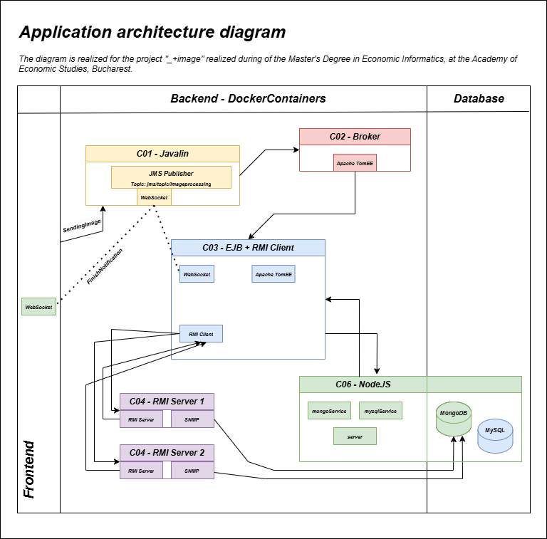

# Image Zoom In-Out Project 🖼️


A distributed system for processing BMP images using Docker containers. The system consists of 6 containers handling different aspects of image processing:

- **Java Backend** with REST API and JMS client
- **Apache TomEE JMS Broker**
- **MDB and RMI Client Container**
- Two **RMI Server Containers** for image processing
- **Node.js Container** with MongoDB and MySQL for data storage

---

## Features 🚀

- Zoom in/out processing for BMP images
- Distributed architecture using Docker
- Real-time processing status updates
- SNMP monitoring
- Blob storage for processed images

---


## Technologies Used 🛠️

- **Frontend**: Vue
- **Backend**: Java (Javalin, Jakarta EE)
- **Message Broker**: Apache TomEE
- **Databases**: MongoDB, MySQL
- **Container Platform**: Docker
- **Monitoring**: SNMP

---

## Getting Started 🚀

### Prerequisites ⚙️

Ensure you have the following installed on your machine:

- **Docker** 🐳
- **Docker Compose** 🐙
- **Java JDK** ☕
- **Node.js** 📦
- **npm** 📦

---

## Installation and Setup 🔧

### 1. Clone the Repository

```bash
git clone <repository-url>
cd image-zoom-in-out
```

### 2. Start Docker Containers

```bash
docker-compose up --build
```

### 3. Frontend Start

```bash
cd .\frontend-src\image-zoom-in-out\
npm install
npm run dev
```


